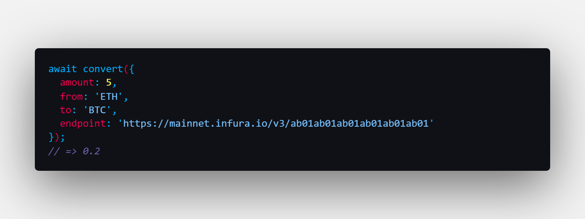

# chainlink-asset-converter

## Super easy conversion between any of the assets currently supported by [Chainlink's price feeds network](https://data.chain.link/)

### Check the [docs](https://pickleyd.github.io/chainlink-asset-converter/)!
